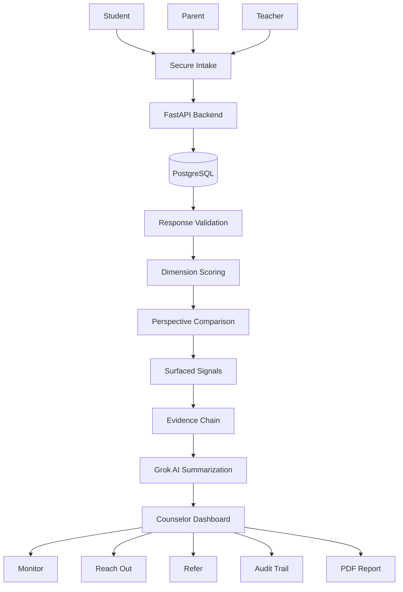

# 🧠 MindLens 

## https://mindlens-tw26.onrender.com/
## Three perspectives. One clearer picture.

MindLens is an AI-assisted, counselor-facing platform that helps schools bring together **Student, Parent, and Teacher perspectives** around the same student.

Instead of forcing three perspectives into one score, MindLens makes their **agreements, differences, and underlying evidence visible** so counselors can investigate what matters.

> MindLens does not diagnose students, generate mental-health risk scores, or replace counselor judgment.

---

## 📌 Table of Contents

| Section | What You'll Find |
|---|---|
| 🌍 Problem | Why student support becomes fragmented |
| 💡 Solution | What MindLens does differently |
| ✨ Key Features | Core product capabilities |
| 🧠 Intelligence Flow | End-to-end MindLens workflow |
| 📊 Perspective View | Six-dimension comparison |
| 🔎 Evidence Chain | How every signal remains traceable |
| 🤖 AI Boundary | How Grok is used responsibly |
| 🏗️ Architecture | Technical system structure |
| 🛠️ Tech Stack | Technologies used |
| 🔐 Security | Privacy and access model |
| 💼 Business Model | Pricing and licensing |
| 🚀 Roadmap | What's next |
| ⚙️ Setup | Run MindLens locally |

---

# 🌍 The Problem

A counselor rarely sees a student from only one perspective.

A student may describe themselves one way.

A parent may observe something different at home.

A teacher may notice another pattern in the classroom.

The counselor has to bring these perspectives together, remember previous conversations, compare observations, and decide what deserves further investigation.

### The scale makes this harder.

According to the WHO, approximately **1 in 7 adolescents aged 10–19 experiences a mental health condition globally**.

At the same time, the 2024–25 U.S. national student-to-school-counselor ratio was approximately **371 students per counselor**, compared with the ASCA-recommended 250:1.

The challenge is therefore not simply collecting more information.

> **The challenge is turning fragmented information into something a counselor can understand quickly.**

---

# 💡 The Insight

Research shows that different informants frequently disagree when describing the same young person.

A 2026 study examining parent, child, and teacher ratings found **low-to-moderate agreement between informants**, and lower parent-teacher agreement was associated with greater behavioral and emotional problems.

This changed our question.

We didn't ask:

> "How do we find the one correct score?"

We asked:

> **"What if the difference between perspectives is itself worth investigating?"**

---

# 🚀 The Solution

MindLens creates a structured workflow around three independent perspectives:

```text
Student
   │
Parent ───────► MindLens ───────► Counselor
   │
Teacher
```

Each rater receives an independent secure intake link through a dedicated QR code.

Their responses are stored separately and structured across six dimensions.

MindLens then brings those perspectives together so the counselor can see:

```text
Independent Perspectives
          ↓
Structured Responses
          ↓
Dimension Scores
          ↓
Perspective Comparison
          ↓
Surfaced Differences
          ↓
Evidence Chain
          ↓
Counselor Review
```

---

# ✨ Key Features

| Feature                  | Description                                           | Value                                 |
| ------------------------ | ----------------------------------------------------- | ------------------------------------- |
| 🔗 3-QR Intake           | Separate Student, Parent and Teacher intake links     | Independent perspectives              |
| 🧩 Six Dimensions        | Structured comparison across six dimensions           | Consistent longitudinal view          |
| 📊 Perspective Bar Graph | Student, Parent and Teacher scores shown side-by-side | Makes differences immediately visible |
| 🚩 Surfaced Signals      | Highlights configured perspective differences         | Helps prioritize investigation        |
| 🔎 Evidence Chain        | Traces a signal back to underlying responses          | No black-box output                   |
| 🤖 Grok AI Layer         | Summarizes structured multi-rater information         | Reduces information overload          |
| 👩‍⚕️ Counselor Review   | Monitor / Reach Out / Refer                           | Keeps decision-making human           |
| 📄 PDF Reports           | Generates documented case reports                     | Easier record keeping                 |
| 📝 Audit Trail           | Records important case and assessment events          | Accountability and traceability       |
| 🔐 Secure Intake         | Tokenized, scoped rater sessions                      | Protects independent responses        |

---

# 📊 Perspective View

MindLens currently organizes responses across six dimensions:

1. Attention & Persistence
2. Activity
3. Adaptability
4. Sensitivity
5. Sociability
6. Self-Regulation

The counselor sees the three perspectives together:

```text
Dimension              Student     Parent     Teacher

Attention & Persistence   ███████    ██████     ████████
Activity                  ██████     ███████    █████
Adaptability              ████████   █████      ███████
Sensitivity               █████      ███████    ██████
Sociability               ███████    ████████   ██████
Self-Regulation           ██████     █████      ███████
```

The purpose is not to determine who is "correct".

The purpose is to make differences **visible and investigateable**.

If a rater has not completed their assessment, MindLens displays:

```text
NO RESPONSE
```

rather than treating missing information as zero.

---

# 🔎 Evidence Chain

MindLens is designed around traceability.

A counselor should be able to move from:

```text
Surfaced Signal
      ↓
Dimension
      ↓
Rater Pair
      ↓
Dimension Scores
      ↓
Underlying Responses
      ↓
Research / Configuration
```

This is exposed through the **"Why was this flagged?"** Evidence Chain Drawer.

The goal is simple:

> **Every important output should have a path back to its source.**

---

# 🤖 AI — With a Boundary

MindLens uses the **Grok API** through the backend to help summarize and organize structured multi-rater information.

AI is intentionally constrained.

### AI CAN

* Summarize multi-rater responses
* Organize contextual information
* Help communicate differences clearly
* Assist the counselor in reviewing information

### AI CANNOT

* Diagnose a student
* Generate a self-harm probability
* Generate an overall mental-health risk score
* Decide which rater is correct
* Automatically recommend a clinical intervention
* Replace counselor judgment

Our design principle is:

```text
AI → Surface → Explain
              ↓
         HUMAN REVIEW
              ↓
       COUNSELOR DECISION
```

Not:

```text
AI → Predict → Label → Automate
```

---

# 🧑‍🏫 Counselor Workflow

### 01 — Create Case

The counselor creates a student case.

### 02 — Generate Three Secure Intakes

MindLens creates independent QR codes for:

```text
STUDENT
PARENT
TEACHER
```

### 03 — Collect Perspectives

Each participant completes their assessment independently.

### 04 — Structure

Responses are stored and mapped to the configured dimensions.

### 05 — Compare

MindLens compares the available perspectives using the configured discrepancy methodology.

### 06 — Investigate

The counselor reviews the Perspective Bar Graph and Surfaced Signals.

### 07 — Trace

The counselor opens the Evidence Chain to understand why something was surfaced.

### 08 — Decide

The counselor records:

```text
Monitor
Reach Out
Refer
```

### 09 — Document

MindLens records the review and generates an auditable PDF report.

---

# 🧠 Intelligence Flow



---

# 🏗️ System Architecture

```text
┌─────────────────────────────────────────────┐
│              COUNSELOR PORTAL              │
│                                             │
│ Cases · Heatmap · Signals · Evidence        │
│ Review · Audit · Reports                    │
└──────────────────────┬──────────────────────┘
                       │
                       ▼
┌─────────────────────────────────────────────┐
│               FASTAPI BACKEND               │
│                                             │
│ Auth · Intake · Scoring · Comparison        │
│ Signals · Evidence · Review · Reports       │
└───────────────┬─────────────────┬───────────┘
                │                 │
                ▼                 ▼
        ┌──────────────┐   ┌──────────────┐
        │ PostgreSQL   │   │   Grok API   │
        │              │   │              │
        │ Responses    │   │ Summarization│
        │ Scores       │   │              │
        │ Signals      │   │              │
        │ Audit Events │   │              │
        └──────────────┘   └──────────────┘
```

---

# 🛠️ Tech Stack

### Frontend

* Next.js 14
* React
* TypeScript
* Tailwind CSS
* Framer Motion
* Recharts

### Backend

* Python 3.10+
* FastAPI
* Pydantic
* SQLModel
* Pytest

### Database

* PostgreSQL 15+

### AI

* Grok API

### Security

* Secure random intake tokens
* Token hashing
* Token expiration
* Session-level isolation
* Server-side authorization
* Audit logging

### Documents

* ReportLab
* PDF generation

### Infrastructure

* Docker
* Docker Compose

---

# 🔐 Security & Privacy

MindLens handles sensitive student information, so security is part of the architecture rather than an afterthought.

The system is designed around:

* Independent rater sessions
* Scoped intake tokens
* Token expiration
* Case isolation
* Server-side authorization
* PostgreSQL as the source of truth
* Audit events
* No frontend-only case persistence
* No client-controlled case ownership
* No exposure of one rater's responses to another rater

MindLens does not claim regulatory compliance or clinical efficacy without appropriate validation.

---

# 💼 Business Model

MindLens follows a district-first, per-building licensing model rather than 
per-seat pricing — because counselor staffing changes constantly, but 
building budgets don't.

| Tier | Price | Includes |
|---|---|---|
| 🟢 Pilot | Free (1 semester, 1 school) | Full features, no card required |
| 🔵 School License | $2,500 / school / year | Unlimited cases, Evidence Chain, PDF reports |
| 🟣 District License | $8,000–$25,000 / year | Volume-discounted, SIS integration, FERPA DPA, admin dashboard |
| ⚫ Enterprise | Custom (from ~$40,000/year) | Multi-year, multi-district, dedicated support |

For context: comparable K-12 SEL/MTSS platforms (e.g. Panorama Education) 
typically run $4,000–$55,000 per district for a single survey module, and 
$16,000–$400,000 for comprehensive multi-year agreements. MindLens is priced 
to complement these tools rather than compete with their budget line.

We deliberately avoid per-student pricing: it penalizes exactly the 
under-resourced, high-ratio districts (372:1 nationally) that need this most.

---

# 🧪 Validation

The next question isn't:

> "Do counselors like the interface?"

The real question is:

> **"Does MindLens help counselors understand cases better?"**

We plan to measure:

| Metric           | Question                                              |
| ---------------- | ----------------------------------------------------- |
| ⏱️ Time          | How quickly can a counselor understand a case?        |
| 🔍 Detection     | Can they identify meaningful perspective differences? |
| 📚 Evidence      | Can they understand why something was surfaced?       |
| 🎯 Usefulness    | Are surfaced differences useful?                      |
| 🤝 Trust         | Do counselors trust the information presented?        |
| 🧭 Investigation | Does the information change what they investigate?    |
| 🔁 Reuse         | Would they use the workflow again?                    |
| 🏫 Adoption      | Would an institution find enough value to deploy it?  |

A small pilot will not be treated as evidence of clinical efficacy.

---

# 🚧 Challenges

The hardest technical and conceptual problem was making three perspectives genuinely comparable.

A parent, teacher and student do not observe the same environment.

A teacher sees classroom behavior.

A parent sees home behavior.

A student experiences their own internal perspective.

Simply combining their answers into one score risks hiding exactly the differences that matter.

This forced us to design MindLens around **comparison rather than forced consensus**.

---

# 🏆 What We Built

MindLens is more than a questionnaire.

It is an end-to-end counselor workflow:

```text
3 Perspectives
      ↓
Secure Intake
      ↓
Structured Responses
      ↓
Six Dimensions
      ↓
Perspective Comparison
      ↓
Bar Graph
      ↓
Evidence Chain
      ↓
Grok Summarization
      ↓
Counselor Review
      ↓
Audit + PDF
```

The central idea is:

> **Don't make the counselor search through the information. Make the differences visible.**

---

# 🚀 Roadmap

### Phase 1 — Technical Integrity

Harden authentication, authorization, data persistence, case isolation, token security and the complete intake-to-dashboard pipeline.

### Phase 2 — Counselor Pilot

Test MindLens using realistic de-identified student scenarios.

Measure understanding, speed, trust and investigation behavior.

### Phase 3 — Research Validation

Validate:

* Assessment instrument
* Dimension mapping
* Psychometric parameters
* Rater-pair comparison methodology
* Interpretation framework

with appropriate research and clinical input.

### Phase 4 — Institutional Scale

Explore deployment across:

* Schools
* Counseling organizations
* Student-support programs

while maintaining privacy, auditability and human oversight.

---

# ⚙️ Local Setup

## Prerequisites

* Node.js
* Python 3.10+
* PostgreSQL 15+
* Docker
* Docker Compose
* Grok API key

## Environment Variables

Create the required environment files using the provided examples.

```env
DATABASE_URL=your_postgresql_connection
GROK_API_KEY=your_grok_api_key
PUBLIC_APP_URL=http://localhost:3000
```

## Run with Docker

```bash
docker-compose up --build
```

The application will start the frontend, backend and PostgreSQL services.

---

# 🎬 Demo Flow

A recommended 2–3 minute demonstration:

```text
Counselor Dashboard
       ↓
Create Student Case
       ↓
Generate 3 QR Codes
       ↓
Student → Submit
Parent → Submit
Teacher → Submit
       ↓
Open Perspective View
       ↓
Show Six-Dimension Bar Graph
       ↓
Open Surfaced Signal
       ↓
"Why was this flagged?"
       ↓
Evidence Chain
       ↓
Grok Summary
       ↓
Counselor Review
       ↓
Monitor / Reach Out / Refer
       ↓
Generate PDF
```

---

# 💭 The Bigger Idea

A student isn't one score.

A parent isn't one score.

A teacher isn't one score.

They are three perspectives on the same person.

MindLens doesn't try to decide which perspective is correct.

**It brings the perspectives together so the counselor can see more clearly.**

## Three perspectives. One clearer picture.
